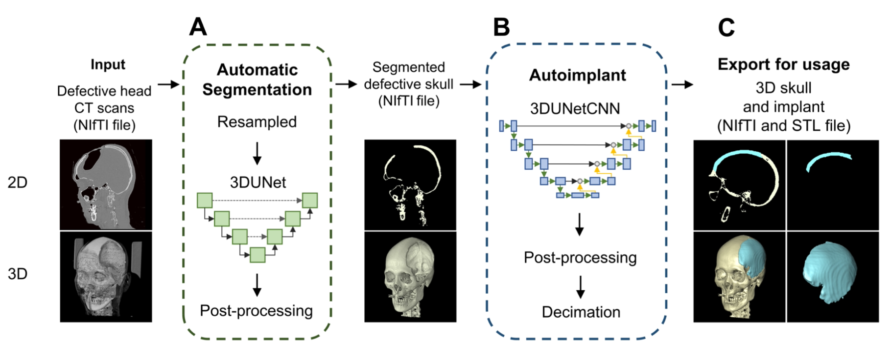

# AutoimplantPipe

<p align="center">
  
</p>

This is a repository for the paper _"An End-to-End Pipeline for Automatic Patient-Specific Cranial Implant Design:
From CT Scans to Titanium Implants"_. The repository contains the following implementations:

1. **Automatic skull segmentation** predicts 3D skulls from a given CT Scans in grayscale
2. **Autoimplant** predicts complete skull from a defective skull

## Autoimplantpipe, notebooks, and training scripts

- **Autoimplantpipe** contains a library for autoimplant pipeline described in the paper.
- **Notebooks** folder contains notebook for automatic skull segmentation and autoimplant inferences including
  - `01_autosegmentation.ipynb` is an example notebook for performing skull segmentation
  - `02_autoimplant_prediction.ipynb` is an example notebook for performing autoimplant inference
- **Scripts** folder contains scripts for training automatic skull segmentation and autoimplant models.

We provide the pretrained models for segmentation and autoimplant
[below](#Results-and-Models). Additionally, we provide an example SkullBreak data for autoimplant inference
[data folder](./data/skullbreak_parietotemporal_001.nii.gz).

## Results and Models

Dice score and model checkpoints for segmentation and autoimplant models.

| Segmentation model  | Dice Score | Checkpoint                                                                                    |
| ------------------- | :--------: | --------------------------------------------------------------------------------------------- |
| Unet + Post Process |   0.9100   | [link](https://drive.google.com/file/d/1__LxfFFNa7lquG8mT2unGBgNqRvVVFlj/view?usp=share_link) |

| Autoimplant model               | Dice Score | Checkpoint                                                                                    |
| ------------------------------- | :--------: | --------------------------------------------------------------------------------------------- |
| PCA                             |   0.7773   | [notebook](./notebooks/00_pca_registration.ipynb)                                             |
| 3DUNetCNN off-the-shelf         |   0.9205   | [link](https://zenodo.org/record/4289225)                                                     |
| 3DUNetCNN SkullBreak            |   0.9464   | [link](https://drive.google.com/file/d/1Zvj3xa1E2pHV-Ykvqa70S5IOhiMWVL39/view?usp=share_link) |
| 3DUNetCNN in-house              |   0.9711   | [link](https://drive.google.com/file/d/1JjpowfEFn7cqoKe1oKg699XoWad2PDZl/view?usp=share_link) |
| 3DUNetCNN SkullBreak + in-house |   0.9715   | [link](https://drive.google.com/file/d/1XrgC84nhVJVHKtgC5jGLhXckup2A5BMK/view?usp=sharing)    |

**Note:** please contact the main author if you want an access to in-house checkpoints.

## Installation

Download the repository using `git`:

```sh
git clone https://github.com/biodatlab/autoimplantpipe
cd autoimplantpipe
```

Install dependencies and library using `pip`:

```sh
pip install -r requirements.txt  # install dependencies
pip install .  # install `autoimplantpipe` library
```
